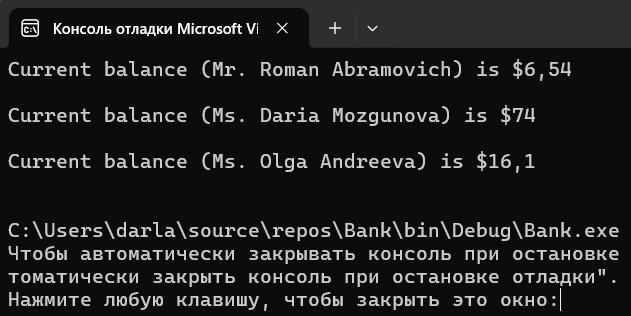
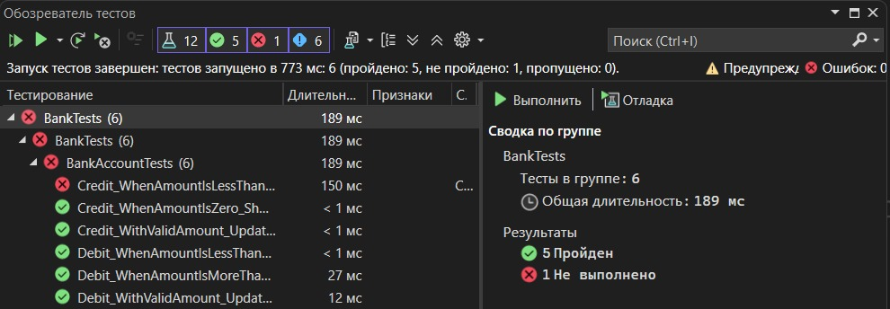

# Практическая работа №6 Создание автоматизированных Unit-тестов (Часть 1)

#### Cкриншоты результатов работы приложения:

#### Cкриншот окна «Обозреватель тестов» 

#### Вывод о проведенном тестировании: 
Написала 6 автотестов для программы, 5 из них удачные, а один нет. В этом тесте специально была сделана ошибка – вместо отрицательной суммы (которая должна была вызвать исключение) была передана положительная сумма (20.0). В результате метод Credit() корректно увеличил баланс, и исключение не было вызвано, что привело к падению теста. Также выполнила рефакторинг исходного кода и написала свои собственный тесты для метода Credit().

